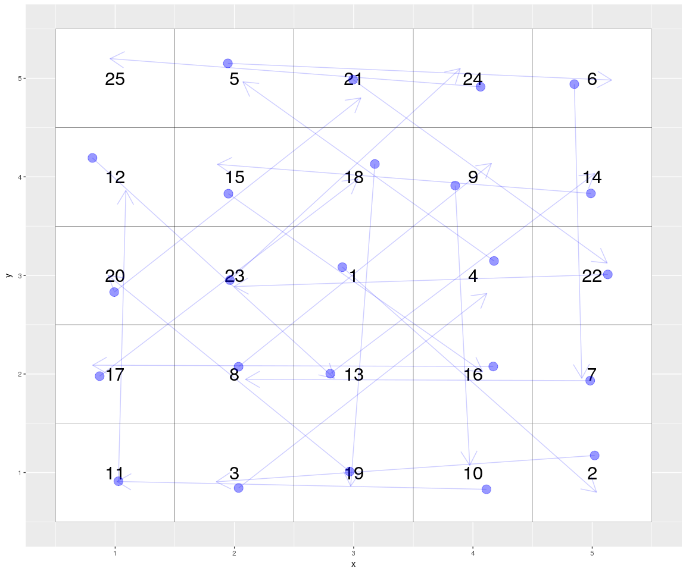
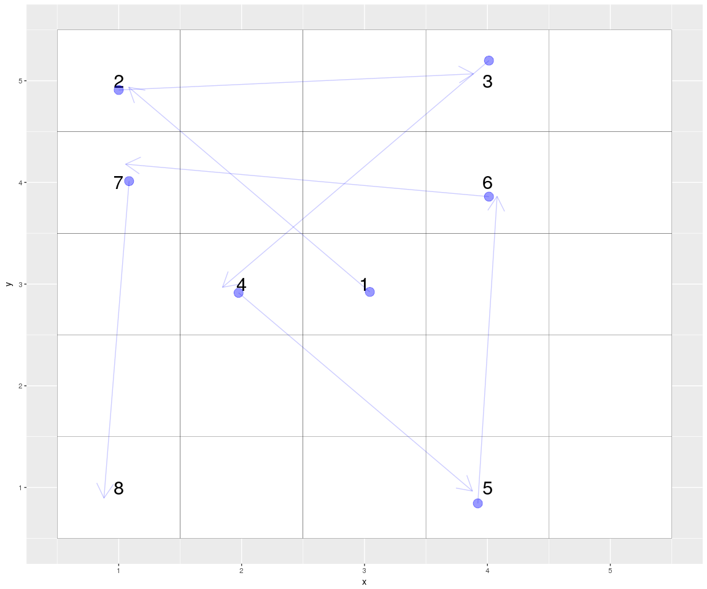

Riddler 2018-07-27: The Perfect Doodle Puzzle To Keep You Busy During Boring Meetings
================

Riddler
-------

[Link to Riddler](https://fivethirtyeight.com/features/the-perfect-doodle-puzzle-to-keep-you-busy-during-boring-meetings/)

### Solution

**It is possible to win from any starting position on the 5x5 grid!** An example from where we start from the middle is shown below:



### Solutions Part 2

Of course, there is more to explore here. Some questions that I explore:

1.  What are the best starting positions based on the average number of moves that one can make?
2.  What is the minimum number of moves from each starting position one can make?
3.  What is the maximum number of moves from each starting position one can make?

#### What are the best starting positions based on the average number of moves that one can make?

In order to answer this question, I ran a total of 25,000 simulations spanning all starting positions. Each simulation ends with a grid being completely filled on all 25 squares, or when there are no more legal moves left to make (next move will fall off the grid or visit a previously-visted space).

Something to note is that the board can be simplified because the moves that you can make are symmetrical in all directions. We can divide the board up into the following six groups colored below:


This shows the distribution of legal moves by starting point:


And looking at the average, the greener squares are the better starting positions. Looking at the pattern below, the further you are from the center, the better off you are.


#### What is the minimum number of moves from each starting position one can make?

If you are trying to lose in the minimum number of moves, you can do so in just 8 moves! Example below again starting from the center square.




#### What is the maximum number of moves from each starting position one can make?

As mentioned earlier, we can beat the game from any starting position!


------------------------------------------------------------------------

### Appendix: Code Used to solve Riddler

``` r
# Function to navigate through a single 5x5 grid

navigate <- function(start = c(3, 3)){
  
  # Initialize data frame to represent 5x5 grid
  df <- data.frame(x = rep(1:5, each = 5),
                   y = rep(1:5, times = 5),
                   visited = 0)
  
  # Initialize starting position as visited == 1
  df[df$x == start[1] & df$y == start[2], 'visited'] <- 1
  
  move_directions <- function(df, direction){
    
    if(direction == 'NE'){
      next_x <- current_x + 2
      next_y <- current_y + 2
    } else if(direction == 'NW'){
      next_x <- current_x - 2
      next_y <- current_y + 2
    } else if(direction == 'SW'){
      next_x <- current_x - 2
      next_y <- current_y - 2
    } else if(direction == 'SE'){
      next_x <- current_x + 2
      next_y <- current_y - 2
    } else if(direction == 'N'){
      next_x <- current_x
      next_y <- current_y + 3
    } else if(direction == 'S'){
      next_x <- current_x
      next_y <- current_y - 3
    } else if(direction == 'E'){
      next_x <- current_x + 3
      next_y <- current_y
    } else if(direction == 'W'){
      next_x <- current_x - 3
      next_y <- current_y
    }
    
    if(next_x > 5 | next_x < 1 | next_y > 5 | next_y < 1){
      # Next move falls off the grid
      return('move again')
    }
    if(df[df$x == next_x & df$y == next_y, 'visited'] > 0){
      # Next move has already been visited
      return('move again')
    }
    df[df$x == next_x & df$y == next_y, 'visited'] <- max(df$visited) + 1
    return(df)
  }
  
  # Loop through a 25 times because maximum is 25 moves
  for(i in 1:25){
    
    current_x <- df[df$visited == max(df$visited), 'x']
    current_y <- df[df$visited == max(df$visited), 'y']
    
    # Select random order to move in
    move_order <- sample(c('N', 'S', 'E', 'W', 'NE', 'NW', 'SW', 'SE'), size = 8)
    
    for(dir in move_order){
      new_df <- move_directions(df, dir)
      if(new_df != 'move again'){
        df <- new_df
        break
      }
      if(dir == move_order[8]){
        # If you made it through all directions and are stuck, unsuccessful run!
        # Return data frame as is
        return(df)
      }
    }
  }
  return(df)
}
```

``` r
# Function to loop through and generate n_samples simulations for each starting point

loop_navigate <- function(n_samples){
  all_navigates <- list()
  moves_tracker <- list()
  for(x in 1:5){
    for(y in 1:5){
      index <- paste0('(', x, ',', y, ')')
      print(index)
      moves_tracker[[index]] <- numeric()
      all_navigates[[index]] <- list()
      for(samp in 1:n_samples){
        all_navigates[[index]][[samp]] <- navigate(start = c(x, y))
        moves_tracker[[index]][samp] <- max(all_navigates[[index]][[samp]]$visited)
      }
    }
  }
  return(list(all_navigates, moves_tracker))
}
```

``` r
# Function to plot result grid, with arrows
plot_grid <- function(df){
  
  df_arrows <- 
    df %>% 
    filter(visited > 0) %>%
    arrange(visited) %>%
    mutate(end_x = lead(x, 1),
           end_y = lead(y, 1)) %>%
    slice(-nrow(.)) %>%
    mutate_all(jitter)
  
  df %>% 
    ggplot(aes(x, y)) +
    geom_tile(color = 'black', fill = 'white')  +
    geom_text(aes(label = ifelse(visited > 0, visited, ''))) +
    annotate('segment', 
             x = df_arrows$x, xend = df_arrows$end_x, 
             y = df_arrows$y, yend = df_arrows$end_y,
             alpha = 0.2,
             color = 'blue',
             arrow = arrow(length = unit(0.03, 'npc'))) +
    geom_point(data = df_arrows, 
               aes(x, y),
               color = 'blue', alpha = 0.2)
}
```
