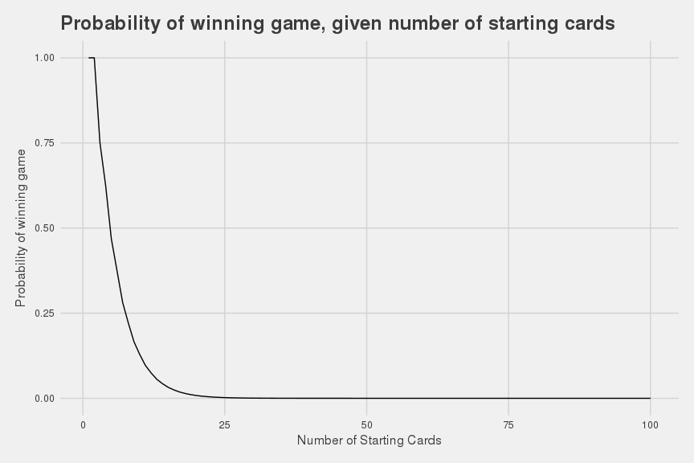

Riddler 2018-08-17: Step 1: Game Theory. Step 2: ???? Step 3: Profit!
================

[Link to Riddler](https://fivethirtyeight.com/features/step-1-game-theory-step-2-step-3-profit/)

------------------------------------------------------------------------

Riddler Express
---------------

From 538:

> Take a standard deck of cards, and pull out the numbered cards from one suit (the cards 2 through 10). Shuffle them, and then lay them face down in a row. Flip over the first card. Now guess whether the next card in the row is bigger or smaller. If you’re right, keep going.

> If you play this game optimally, what’s the probability that you can get to the end without making any mistakes?

> Extra credit: What if there were more cards — 2 through 20, or 2 through 100? How do your chances of getting to the end change?

**Solution:** The probability of winning this game is **16.57%**.

**Explanation:** At every point where you flip your card, the probability of winning that round is the average of the worst and best possible case scenarios for that round. If the round has...

-   **One face down card left:** 100% chance of winning the round
-   **Odd number of face down cards left:** Average of P(worst case scenario) and 1. P(worst case scenario) is `ceiling(n_cards_left / 2) / n_cards_left`.
-   **Even number of face down cards left:** 0.75 (average of 0.5 and 1)

With these two rules established, we simply calculate the probability of winning every round, and multiply all of these probabilities by one another to get the probability of winning that game.

**Work:**

``` r
# Function to calculate probability of winning game with n_cards
calc_game_prob <- function(n_cards,
                           verbose = F) {
  
  # Flip the first card over, no chance of losing
  if(n_cards == 1) {
    return(1)
  }
  n_cards_left <- n_cards - 1
  
  prob_winning_round <- list()
  for(i in 1:(n_cards - 1)) {
    prob_winning_round[[i]] <- mean(c(ceiling(n_cards_left/2)/n_cards_left, 1))
    n_cards_left <- n_cards_left - 1
  }
  
  if(verbose) {
    lapply(prob_winning_round, print)
  }
  
  return(prod(unlist(prob_winning_round)))
}
```

``` r
# To win original game, with numbered cards 2 to 10:
calc_game_prob(n_cards = 9)
```

**Extra Credit:**

The chances of winning the game decrease pretty steadily, **falling below 1% of winning when you have 20 starting cards**. The graph below shows the relationship between the probability of winning the game versus the number of starting cards.

``` r
cards_df <- data.frame(num_starting_cards = 1:100)
cards_df %<>%
  group_by(num_starting_cards) %>%
  mutate(prob_winning = calc_game_prob(num_starting_cards)) %>%
  ungroup
```



------------------------------------------------------------------------

Riddler
-------

> Ariel, Beatrice and Cassandra — three brilliant game theorists — were bored at a game theory conference (shocking, we know) and devised the following game to pass the time. They drew a number line and placed $1 on the 1, $2 on the 2, $3 on the 3 and so on to $10 on the 10.

> Each player has a personalized token. They take turns — Ariel first, Beatrice second and Cassandra third — placing their tokens on one of the money stacks (only one token is allowed per space). Once the tokens are all placed, each player gets to take every stack that her token is on or is closest to. If a stack is midway between two tokens, the players split that cash.

> How will this game play out? How much is it worth to go first?

**Solution:** This game will result in payouts of **Ariel $23; Beatrice $17; Cassandra $15**. Therefore, the price that one should pay to go first is E\[first place money\] - E\[prize money if positions are randomly determined\]. This works out to be $23 - $18.33 = **$4.67 to go first**. That being said, the game will play out like: **Ariel: $10 -&gt; Beatrice: $6 -&gt; Cassandra: $5**

**Explanation:** For this problem, I worked backwards from the 1,000 possible ending positions. The 1,000 possible ending positions are the 10 x 10 x 10 positions each player can take. From there, we see which positions result in payouts where Ariel &gt; Beatrice &gt; Cassandra where nobody can do any better by moving. We then maximize Cassandra and Beatrice's payout, maintaining the payout rule where A &gt; B &gt; C. From this, we end up with the final position in my solution.

**Work:**

``` r
ending_positions <- data.frame(a = rep(1:10, each = 100),
                                b = rep(rep(1:10, each = 10), 10),
                                 c = rep(rep(1:10, 10), 10))

df <- ending_positions %>% replicate(10, ., simplify = F) %>% bind_rows
df %<>% mutate(point = rep(1:10, each = 1e3))

df %<>%
  mutate(a_diff = abs(a-point),
         b_diff = abs(b-point),
         c_diff = abs(c-point),
         min_diff = pmin(a_diff, b_diff, c_diff),
         num_match = (a_diff == min_diff) + (b_diff == min_diff) + (c_diff == min_diff),
         a_payout = (a_diff == min_diff) * point / num_match,
         b_payout = (b_diff == min_diff) * point / num_match,
         c_payout = (c_diff == min_diff) * point / num_match) %>%
  group_by(a, b, c) %>%
  summarise_at(vars(a_payout, b_payout, c_payout), sum) %>%
  ungroup

df %>%
  filter(a_payout > b_payout, b_payout > c_payout) %>%
  mutate(tot_diff = (a_payout - b_payout + b_payout - c_payout)) %>%
  filter(c_payout == max(c_payout)) %>%
  arrange(-a_payout) %>%
  select(-tot_diff) %>%
  kable
```

|    a|    b|    c|  a\_payout|  b\_payout|  c\_payout|
|----:|----:|----:|----------:|----------:|----------:|
|    9|    7|    4|         23|         17|         15|
|   10|    6|    5|         23|         17|         15|
|    5|    9|    8|         21|         19|         15|
|    6|   10|    7|         21|         19|         15|
|    7|   10|    4|         21|         19|         15|
|    8|    9|    3|         21|         19|         15|

------------------------------------------------------------------------
