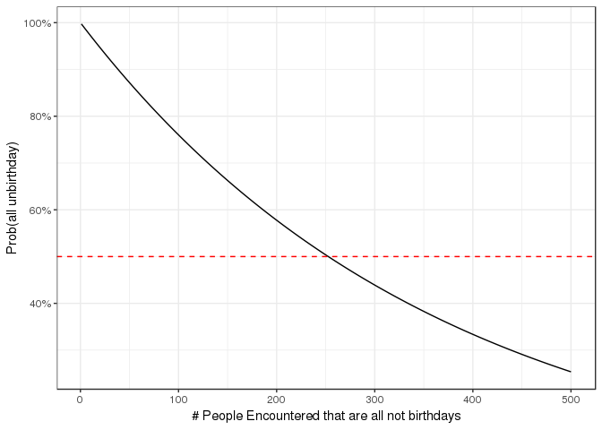
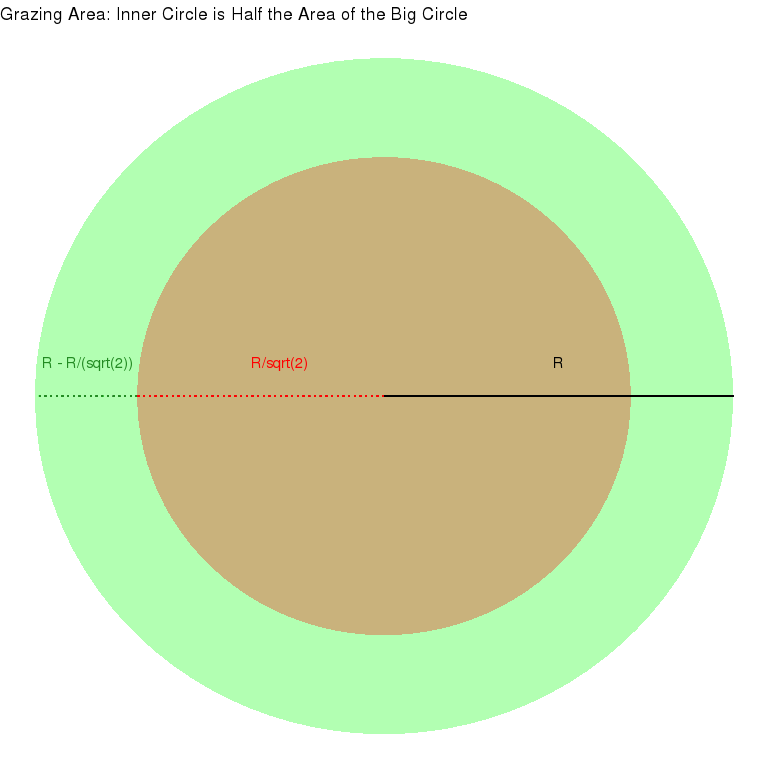

Riddler 2018-10-12: So You Want To Tether Your Goat. Now What?
================

**[Link to Riddler](https://fivethirtyeight.com/features/so-you-want-to-tether-your-goat-now-what/)**

------------------------------------------------------------------------

Riddler Express
---------------

From 538:

> My daughter really likes to hear me sing “The Unbirthday Song” from “Alice in Wonderland” to her. She also likes to sing it to other people. Obviously, the odds of my being able to sing it to her on any random day are 364 in 365, because I cannot sing it on her birthday. The question is, though, how many random people would she expect to be able to sing it to on any given day before it became more likely than not that she would encounter someone whose birthday it is? In other words, what is the expected length of her singing streak?

### Solution

The expected length of her singing streak would be **252 people**.

|  num\_people| prob\_all\_unbirthday |
|------------:|:----------------------|
|          250| 50.365%               |
|          251| 50.227%               |
|          252| 50.090%               |
|          253| 49.952%               |
|          254| 49.815%               |
|          255| 49.679%               |

------------------------------------------------------------------------

Riddler
-------

> A farmer owns a circular field with radius R. If he ties up his goat to the fence that runs along the edge of the field, how long does the goat’s tether need to be so that the goat can graze on exactly half of the field, by area?

### Solution

The length of the goat's tether needs to be **R - R/sqrt(2)**

### Explanation

To get the length, all we need to do is to determine a circle within the field that has half the area of the field. Because of the tether, the goat will not be able to graze this part of the field, which means that it should be able to graze the remaining half of the field.

------------------------------------------------------------------------
